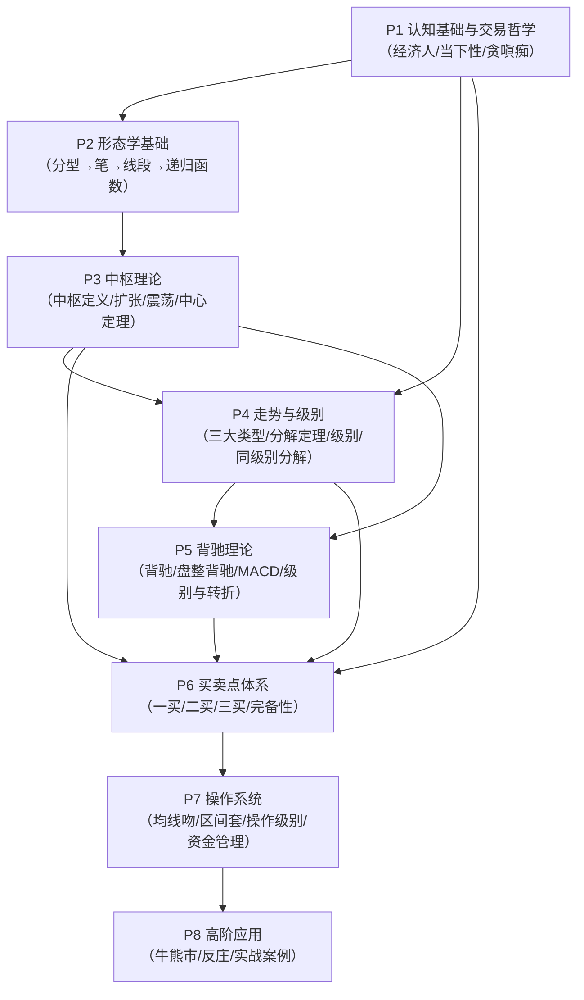

# 00-总论：缠论体系全景

> **文件用途说明**：本文件是 organized-v2 的 AI 系统提示词备选来源，高密度精确内容，信息密度优先。
> 面向 AI 系统，用于快速理解缠论体系架构、路由查询和概念依赖。

---

## 一、缠论体系全景架构



**模块间逻辑依赖说明：**

- **P1**（认知基础）：提供所有模块的哲学前提和操作心态要求，独立成章，影响所有后续模块的操作纪律
- **P2**（形态学）：建立走势结构识别的最小原子构件（分型→笔→线段），通过递归函数f1/f2为P3提供起点
- **P3**（中枢理论）：在P2形态学基础上定义走势中枢，引入四指标体系，建立中枢三命运（延伸/扩张/新生），是P4/P5/P6的关键节点
- **P4**（走势与级别）：将P3中枢组合为三大走势类型（盘整/趋势），引入级别体系和同级别分解，为P5背驰提供走势结构背景
- **P5**（背驰理论）：在P4走势结构基础上定义背驰（趋势力度衰减），区分趋势背驰/盘整背驰，引入MACD辅助判断，为P6买卖点提供信号生成机制
- **P6**（买卖点体系）：整合P3中枢/P4走势/P5背驰，建立三类买卖点的完备操作体系
- **P7**（操作系统）：将P6买卖点转化为可执行的操作程序，包括均线工具、区间套精确定位、操作级别选择、资金管理与止损
- **P8**（高阶应用）：在P6/P7基础上给出牛熊市宏观判断、大资金策略和实战案例示范

---

## 二、核心公理列表

以下为缠论体系的根基性命题，不可由其他命题推导，须直接接受为公理：

1. **走势终完美**：任何级别的任何走势类型终要完成，不可能永远延伸。（课17，P3-08定理四）
2. **完成走势必含中枢**：任何级别的任何完成的走势类型必然包含一个以上的缠中说禅走势中枢。（课17，P3-08定理五）
3. **走势三分类完备性**：市场任意走势片段必然且唯一地归属于上涨/下跌/盘整三类之一，三类互斥穷尽。（课15，P1-01定理三）
4. **自同构性结构绝对复制**：走势的自同构性结构模式在不同级别上绝对复制，由递归定义逻辑保证。（课84，P2-07定义六）
5. **没有趋势，没有背驰**：无趋势（含至少两个同向非重叠中枢）则无趋势背驰可言。（课15，P5-16定理一）
6. **经济人原则**：参与市场的唯一驱动必须是赢钱（资本增殖），任何其他驱动均为喜好陷阱。（课01，P1-01定义一）
7. **价格唯一性公设**：分析依据为市场实际成交价格直接形成的走势，不引入价格之外的信息作为操作触发条件。（课030，P1-02定义一）

---

## 三、查询路由表

| 问题类型 | 首查章节 | 辅助章节 |
|---------|---------|---------|
| 什么是分型/如何判断顶底分型 | [P2-04](P2-形态学基础/P2-04-分型.md) | — |
| 什么是笔/笔的充要条件 | [P2-05](P2-形态学基础/P2-05-笔.md) | P2-04 |
| 什么是线段/线段如何判断终结 | [P2-06](P2-形态学基础/P2-06-线段.md) | P2-05 |
| 形态学与动力学的分工 | [P2-07](P2-形态学基础/P2-07-形态学总论与递归函数.md) | — |
| 走势中枢的定义与计算（ZD/ZG） | [P3-08](P3-中枢理论/P3-08-走势中枢.md) | — |
| 中枢的三种命运（延伸/扩张/新生） | [P3-09](P3-中枢理论/P3-09-中枢的级别扩张.md) | P3-08 |
| 中枢震荡操作（高抛低吸/满仓持有） | [P3-10](P3-中枢理论/P3-10-中枢震荡.md) | P3-09 |
| 中枢中心定理一/二/六价体系/a+A+b+B+c框架 | [P3-11](P3-中枢理论/P3-11-中枢中心定理.md) | P3-09, P3-10 |
| 走势的三大类型（盘整/上涨/下跌）如何判断 | [P4-12](P4-走势与级别/P4-12-走势的三大类型.md) | P3-08 |
| 走势分解定理/结合律/走势多义性 | [P4-13](P4-走势与级别/P4-13-走势分解定理.md) | P4-12 |
| 级别体系/自同构性/图表级别vs走势级别 | [P4-14](P4-走势与级别/P4-14-级别自组织与自相似性.md) | P2-07 |
| 同级别分解/机械化操作程序/买卖不对等性 | [P4-15](P4-走势与级别/P4-15-同级别分解.md) | P4-12, P4-13 |
| 背驰的定义（均线面积法/三大精细条件） | [P5-16](P5-背驰理论/P5-16-背驰.md) | P4-12 |
| 盘整背驰vs趋势背驰如何区分 | [P5-17](P5-背驰理论/P5-17-盘整背驰与趋势背驰.md) | P5-16 |
| MACD如何辅助判断背驰（A-B-C三段/黄白线/零轴） | [P5-18](P5-背驰理论/P5-18-MACD辅助判断背驰.md) | P5-16, P5-17 |
| 背驰级别与转折级别的关系/区间套精确定位 | [P5-19](P5-背驰理论/P5-19-背驰的级别与转折.md) | P5-16, P5-17 |
| 第一类买卖点的定义/走势终完美推导/两大定律 | [P6-20](P6-买卖点体系/P6-20-第一类买卖点.md) | P5-16 |
| 第二类买卖点的定义/绝对安全性 | [P6-21](P6-买卖点体系/P6-21-第二类买卖点.md) | P6-20 |
| 第三类买卖点的定义/三买100%获利性质/六步操作法 | [P6-22](P6-买卖点体系/P6-22-第三类买卖点.md) | P3-11 |
| 三类买卖点的完备性/第一/第二利润最大定理 | [P6-23](P6-买卖点体系/P6-23-三类买卖点的完备性.md) | P6-20, P6-21, P6-22 |
| 均线吻理论（飞吻/唇吻/湿吻/女上位/男上位） | [P7-24](P7-操作系统/P7-24-均线吻理论.md) | — |
| 区间套精确定位/抄底三步法 | [P7-25](P7-操作系统/P7-25-区间套精确定位.md) | P5-19 |
| 操作级别选择/持股持币/机械化操作/消息过滤 | [P7-26](P7-操作系统/P7-26-操作级别选择.md) | P4-15 |
| 资金管理与止损/零成本持股/三程序乘法 | [P7-27](P7-操作系统/P7-27-资金管理与止损.md) | — |
| 牛熊市判断/牛市三阶段/一夜情/大资金策略 | [P8-28](P8-高阶应用/P8-28-牛熊市判断与大资金策略.md) | P7-27 |
| 反庄操作/主力资金食物链/时间阻击/空间阻击 | [P8-29](P8-高阶应用/P8-29-反庄操作.md) | P8-28 |
| 实战案例/当下图解分析法/走势多样性分解 | [P8-30](P8-高阶应用/P8-30-实战案例精解.md) | P6, P7 |
| 当下性哲学/完全分类操作/分段函数操作模型 | [P1-02](P1-认知基础与交易哲学/P1-02-当下性哲学.md) | P1-01 |
| 贪嗔痴疑慢/喜好陷阱/钢铁战士七条/每日复盘 | [P1-03](P1-认知基础与交易哲学/P1-03-贪嗔痴与人性陷阱.md) | P1-01 |
| 经济人原则/股票废纸性/缠论有效性前提 | [P1-01](P1-认知基础与交易哲学/P1-01-市场本质与经济人原则.md) | — |
| 全部定义速查 | [附录A](附录/A-定义速查.md) | — |
| 全部定理索引 | [附录B](附录/B-定理索引.md) | — |
| 全部操作规则查找 | [附录C](附录/C-操作规则总表.md) | — |
| 市场状态→适用规则映射 | [附录D](附录/D-状态条件速查.md) | 附录C |
| 某课文涉及哪些v2章节 | [附录E](附录/E-原文索引.md) | — |

---

## 四、概念层次结构（前置依赖关系）

以下列出关键概念的前置依赖，用于 AI 回答"X 依赖 Y 吗"类问题：

```
【基础层——无前置】
  经济人原则 → 无
  价格唯一性公设 → 无
  走势终完美 → 无（公理）
  完成走势必含中枢 → 无（公理）
  走势三分类完备性 → 无（公理）

【形态学层——依赖基础层】
  包含关系处理 → 价格唯一性公设
  分型（顶/底） → 包含关系处理
  笔 → 分型
  线段 → 笔（特征序列）
  形态学递归f1/f2 → 分型, 笔, 线段

【中枢层——依赖形态学层】
  走势中枢（ZD/ZG） → 线段, 走势分解定理
  Z走势段 → 走势中枢
  GG/G/D/DD四指标 → Z走势段
  中枢三命运 → GG/DD
  中枢中心定理一/二 → Z走势段, GG/DD
  第三类买卖点定理 → 中枢中心定理一（直接推导）

【走势层——依赖中枢层】
  盘整（精确定义） → 走势中枢（单一中枢）
  趋势（精确定义） → 走势中枢（≥2个同向无重叠）
  走势分解定理一/二 → 盘整, 趋势
  级别体系 → 递归函数f2
  同级别分解 → 走势分解定理, 级别体系

【背驰层——依赖走势层】
  趋势力度 → 均线吻, 趋势（至少两个中枢）
  背驰（趋势背驰） → 趋势力度, a+A+b+B+c结构（三大精细条件）
  盘整背驰 → 盘整（单一中枢）, 力度比较
  背驰-转折定理 → 背驰
  背驰级别与转折级别 → 背驰, 走势级别

【买卖点层——依赖背驰层+中枢层】
  第一类买点 → 下跌趋势（≥2中枢）, 趋势背驰, 走势终完美
  第二类买点 → 第一类买点（先存在）, 走势终完美
  第三类买点 → 走势中枢（已形成）, 中枢中心定理一
  三类买卖点完备性 → 第一/二/三类买卖点

【操作层——依赖买卖点层】
  区间套定位 → 背驰段（多级别嵌套）
  操作级别 → 走势级别体系, 资金量
  零成本持股 → 操作级别, 买卖点
  机械化操作程序 → 同级别分解, 盘整背驰
```

---

## 五、各篇章概要与章节索引

### P1：认知基础与交易哲学

**核心定位**：缠论操作的认识论基础。奠定参与市场的唯一目的（赢钱）、信息来源（走势唯一）、操作哲学（当下性/完全分类/不预测）和心理根基（克服贪嗔痴）。所有后续模块的心理和哲学前提均来自此篇。

| 章节 | 一句话要点 |
|------|-----------|
| [P1-01 市场本质与经济人原则](P1-认知基础与交易哲学/P1-01-市场本质与经济人原则.md) | 赢钱是唯一目的，走势是唯一信息源，股票废纸性，只搞能搞的 |
| [P1-02 当下性哲学](P1-认知基础与交易哲学/P1-02-当下性哲学.md) | 价格唯一性，完全分类操作（非预测），分段函数操作模型，破当下执 |
| [P1-03 贪嗔痴与人性陷阱](P1-认知基础与交易哲学/P1-03-贪嗔痴与人性陷阱.md) | 贪嗔痴疑慢是失败唯一根源，喜好陷阱，技术指标是评价系统非预测系统，钢铁战士七条 |

### P2：形态学基础

**核心定位**：缠论几何学的底层构件。从包含关系处理→分型→笔→线段，通过递归函数f1/f2为所有上层结构（中枢、走势类型）提供唯一化的形态学基础。形态学不依赖任何市场假设，是缠论中确定性最强的部分。

| 章节 | 一句话要点 |
|------|-----------|
| [P2-04 分型](P2-形态学基础/P2-04-分型.md) | 顶底分型充要条件，包含关系处理规则，分型客观唯一性 |
| [P2-05 笔](P2-形态学基础/P2-05-笔.md) | 笔三条充要条件（C1/C2/C3），笔划分唯一性定理，四状态数组（D,E） |
| [P2-06 线段](P2-形态学基础/P2-06-线段.md) | 线段至少三笔（奇数），特征序列两种破坏情况（无缺口/有缺口式），线段被线段破坏 |
| [P2-07 形态学总论与递归函数](P2-形态学基础/P2-07-形态学总论与递归函数.md) | 形态学vs动力学，懒人路线图（分型→笔→线段→中枢），f1起始/f2递推，自同构性结构 |

### P3：中枢理论

**核心定位**：缠论的核心计算单元。定义走势中枢（ZD/ZG）、Z走势段（GG/DD/G/D）、中枢三命运，并通过中枢中心定理一/二建立中枢延伸/扩张/趋势的判断逻辑。第三类买卖点直接由中枢中心定理一推导。

| 章节 | 一句话要点 |
|------|-----------|
| [P3-08 走势中枢](P3-中枢理论/P3-08-走势中枢.md) | 中枢定义充要条件ZD=max/ZG=min，中枢三大定理，盘整/趋势精确定义，走势终完美公理 |
| [P3-09 中枢的级别扩张](P3-中枢理论/P3-09-中枢的级别扩张.md) | Z走势段，GG/DD四指标，中枢三命运，背驰-转折定理（三种结果），走势级别延续定理 |
| [P3-10 中枢震荡](P3-中枢理论/P3-10-中枢震荡.md) | 中枢延伸充要条件，震荡中轴Z/Zn序列，进场三类框架，中枢震荡差价vs中枢移动满仓 |
| [P3-11 中枢中心定理](P3-中枢理论/P3-11-中枢中心定理.md) | 六价体系（ZG/ZD/GG/G/D/DD），中枢中心定理一/二，第三类买卖点定理推导，a+A+b+B+c框架，第一/第二利润最大定理 |

### P4：走势与级别

**核心定位**：在P3中枢基础上建立走势类型体系和级别体系。走势分解定理保证任意走势可分解为三类连接；同级别分解给出最优机械化操作框架；自同构性保证不同级别使用相同操作方法。

| 章节 | 一句话要点 |
|------|-----------|
| [P4-12 走势的三大类型](P4-走势与级别/P4-12-走势的三大类型.md) | 盘整（单一中枢）/趋势（≥2个无重叠同向中枢）精确定义，六种走势组合分类，每日走势三大分类 |
| [P4-13 走势分解定理](P4-走势与级别/P4-13-走势分解定理.md) | 技术分析基本原理一（走势终完美），走势分解定理一/二，结合律，走势多义性，a+A+b+B+c标准结构 |
| [P4-14 级别自组织与自相似性](P4-走势与级别/P4-14-级别自组织与自相似性.md) | 走势级别体系（Xn/Yn/Wn/Sn/Rn/Zn/Mn/Jn/Nn），图表级别vs走势级别，级别与时间无关，自同构性绝对复制 |
| [P4-15 同级别分解](P4-走势与级别/P4-15-同级别分解.md) | 同级别分解唯一性，a+A结构两类图形，级别自动换档，多重赋格，买卖不对等性，1/5/30分钟三层次完全分类 |

### P5：背驰理论

**核心定位**：缠论动力学的核心。在走势结构基础上，通过力度衰减（均线面积/MACD）判断走势终结。区分趋势背驰/盘整背驰是"小学毕业"的门槛；背驰-转折定理保证背驰后的必然逆转；区间套定位提供精确入场工具。

| 章节 | 一句话要点 |
|------|-----------|
| [P5-16 背驰](P5-背驰理论/P5-16-背驰.md) | 趋势力度（均线面积），背驰定义充要条件，课37三大精细条件（A/B同级别/c为次级别/c创新极值），背驰段≠背驰 |
| [P5-17 盘整背驰与趋势背驰](P5-背驰理论/P5-17-盘整背驰与趋势背驰.md) | 背驰-转折定理（三种后果），趋势背驰必回最后中枢，大级别盘整背驰=历史底部，区间套精确定位程序 |
| [P5-18 MACD辅助判断背驰](P5-背驰理论/P5-18-MACD辅助判断背驰.md) | MACD标准方法（A-B-C三段+黄白线回0轴+柱子面积），先结构后指标顺序原则，零轴防狼术，1分钟以下vs1分钟及以上的差异 |
| [P5-19 背驰的级别与转折](P5-背驰理论/P5-19-背驰的级别与转折.md) | 背驰级别≥转折级别（绝对预测），同级背驰必然回最后中枢，小背驰-大转折定理（仅必要条件），三重区间套嵌套定理 |

### P6：买卖点体系

**核心定位**：缠论操作的核心信号层。三类买卖点由不同的理论前提推导，形成完备操作体系（缠论操作的唯一三类机会）。第一利润最大/第二利润最大定理给出最优操作模式。

| 章节 | 一句话要点 |
|------|-----------|
| [P6-20 第一类买卖点](P6-买卖点体系/P6-20-第一类买卖点.md) | 下跌趋势末端趋势背驰→一买，走势终完美推导一买必然存在，缠中说禅买卖点定律一，缠中说禅趋势转折定律 |
| [P6-21 第二类买卖点](P6-买卖点体系/P6-21-第二类买卖点.md) | 一买后第一次次级别回调低点，绝对安全性（走势终完美保证），必然形成更大级别中枢，二三买重合唯一条件 |
| [P6-22 第三类买卖点](P6-买卖点体系/P6-22-第三类买卖点.md) | 中枢后次级别离开+回试低点不破ZG，100%获利性质，三买后两种情况（中枢新生/扩张），最近中枢原则，5段结构最低要求，三买买卖法六步骤 |
| [P6-23 三类买卖点的完备性](P6-买卖点体系/P6-23-三类买卖点的完备性.md) | 完备性定理（市场赢利机会只有三类），升跌完备性定理，第一/第二利润最大定理，五种大小买卖点组合分析 |

### P7：操作系统

**核心定位**：将买卖点信号转化为可执行的操作程序。均线吻提供早期识别工具；区间套给出精确入场方法；操作级别选择解决"用哪个级别"问题；资金管理/止损确保长期生存。

| 章节 | 一句话要点 |
|------|-----------|
| [P7-24 均线吻理论](P7-操作系统/P7-24-均线吻理论.md) | 飞吻/唇吻/湿吻三分类，女上位/男上位体位，均线买卖系统完整操作循环，斐波那契均线参数，板块强弱指标 |
| [P7-25 区间套精确定位](P7-操作系统/P7-25-区间套精确定位.md) | 精确大转折点寻找程序定理，逐级背驰段收窄区间，抄底三步法，背驰-转折定理三种后果区分 |
| [P7-26 操作级别选择](P7-操作系统/P7-26-操作级别选择.md) | 操作级别由资金量/通道/时间决定，持股/持币两种基本状态，操作级别决定消息过滤，机械化操作收益定理 |
| [P7-27 资金管理与止损](P7-操作系统/P7-27-资金管理与止损.md) | 走势止损（非百分比止损），零成本持股唯一消除风险，三程序乘法降低误判率，禁止杠杆（最高优先级） |

### P8：高阶应用

**核心定位**：P1-P7的综合实战运用。牛熊市判断提供宏观框架；反庄操作揭示市场生态；实战案例示范完整的当下图解分析法。三个章节均依赖P1-P7的完整理论体系。

| 章节 | 一句话要点 |
|------|-----------|
| [P8-28 牛熊市判断与大资金策略](P8-高阶应用/P8-28-牛熊市判断与大资金策略.md) | 牛市三阶段论，牛市一夜情（暴跌≠顶），越跌越买大资金策略，积累筹码降成本，政策面最多制造周线级别震荡 |
| [P8-29 反庄操作](P8-高阶应用/P8-29-反庄操作.md) | 主力资金食物链，时间阻击vs空间阻击，做顶出货（合力的贪嗔痴疑慢），做底吸货（0成本筹码），买卖点不可逃避定理 |
| [P8-30 实战案例精解](P8-高阶应用/P8-30-实战案例精解.md) | 当下图解分析法（不预测只分类），走势多样性分解，茅台/驰宏锌锗/530印花税等案例，当下分析完全分类定理 |

---

## 附录导航

| 附录 | 用途 |
|------|------|
| [附录A：定义速查](附录/A-定义速查.md) | 全部📖定义条目，按P1→P8排列，可快速查找概念精确表述 |
| [附录B：定理索引](附录/B-定理索引.md) | 全部📐定理条目，含前提条件和结论，按P1→P8排列 |
| [附录C：操作规则总表](附录/C-操作规则总表.md) | 全部💡操作规则，按操作场景分组，含规则ID和操作步骤 |
| [附录D：状态条件速查](附录/D-状态条件速查.md) | 常见市场状态→适用规则ID映射，含优先级说明 |
| [附录E：原文索引](附录/E-原文索引.md) | 课文编号→涉及v2章节列表，按课文编号从小到大排序 |
